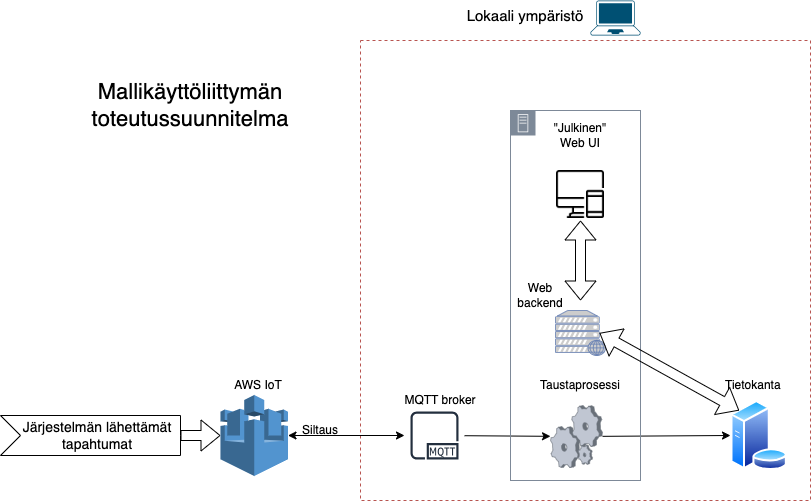

# Example application to use the events generated by the core device

The basic architecture of this solution is seen on the image below.
The idea is to provide some example for utilizing the core-device-generated data.
This example relies on local mosquitto instance to be bridged to AWS IoT with the same AWS account that the core device is connected to.
**Not a production ready implementation.**

> NOTE: This is a proof-of-concept. Already implemented features are listed below and it is unlikely more will be implemented.

### MqttWorkerService

This is a background process that:

- Starts a local mosquitto instance **Does not start it anymore because is inside docker now**
  - Uses mosquitto configuration file path in **MOSQUITTO_CONF_FILE** variable if provided
    - The local instance can be bridged to Aws Iot. The configuration file template is provided in the root of this project. For instructions on how to setup the bridge, see [this tutorial](https://aws.amazon.com/blogs/iot/how-to-bridge-mosquitto-mqtt-broker-to-aws-iot/)
- Subsribes to MyGreengrassCore/publish topic
- Saves received events in database
- Processes events:
  - Creates new user / tool based on "newtag" events
  - Marks user / tool as deleted based on "delete" events
  - Changes tool state based on "borrow" events
  - All other types of events (See Datamodels-project) are just saved as not processed

### WebUI

- User list with some info
- Tool list with some info, e.g. currently borrowed or not
- Event history with some info
Also all of the pages have a possibility to drilldown into single entity to see more details about it